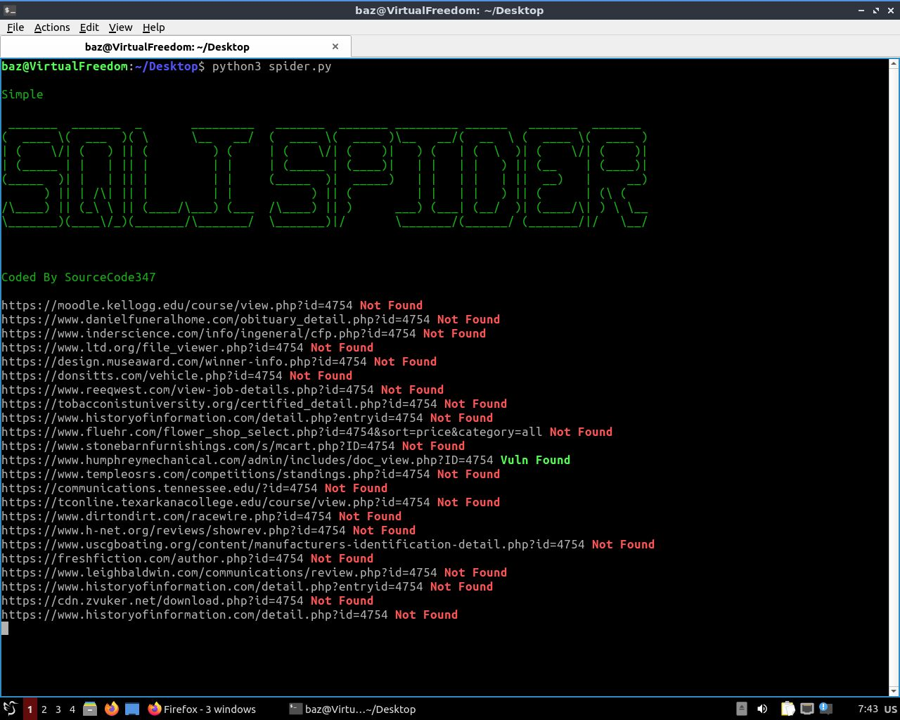

# SQLISpider
A very simple example of how the SQLI Spiders work ...

</img>

Now imagine more advanced spiders searching the web for sqli vulnerabilities and finding them, then automatically running sqlmap and extracting all the data from a server database.

All automated!

I certainly would not give an advanced code that has made possible attacks in the past.

But I can show you an example of how to grow your own and have permanent spiders research the web for vulnerabilities.

To run such code you will need to have the latest version of Firefox and python, installed.

Install the following Python libraries via pip.

    pip install selenium
    
    pip install termcolor

If you are on Windows, this utility library will also be needed for the terminal colors to work.

    pip install colorama

and add these 2 lines to the 43 lines of code

    import colorama
    
    colorama.init ()

Also to test firefox automatically, you will need to download the geckodriver and set its path to the executable_path variable in row 66 of the code.

By default I have it to be headless, ie not to show what processes firefox is running. You can prevent this by putting a # in front of the command line 66 of the code and turning it into a comment.
